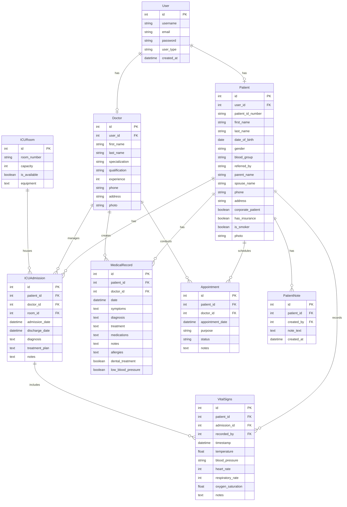
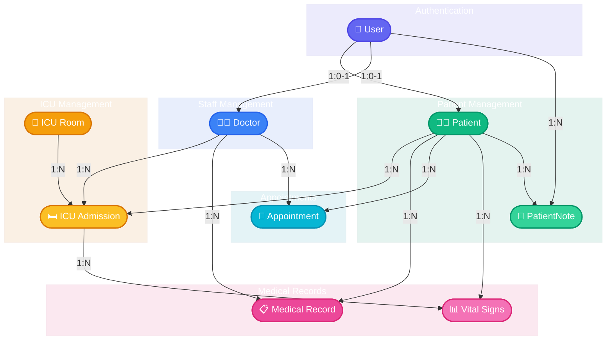

# ICU Rooms Department - Hospital Information System

A comprehensive Hospital Information System (HIS) specifically designed for managing ICU Rooms, patients, doctors, medical records, and appointments.

## Project Description

This system helps hospital staff manage intensive care unit operations efficiently. It allows tracking of patient admissions, monitoring vital signs, managing appointments, and maintaining medical records for improved patient care in the ICU.

## Database Schema

### ER Diagram

## Detailed Database Schema

### 🔐 User Management
<table>
  <tr>
    <th colspan="3" align="left">👤 User</th>
  </tr>
  <tr>
    <th>Field</th>
    <th>Type</th>
    <th>Description</th>
  </tr>
  <tr>
    <td><code>id</code></td>
    <td>Integer</td>
    <td><strong>Primary Key</strong></td>
  </tr>
  <tr>
    <td><code>username</code></td>
    <td>String</td>
    <td>Unique, Not Null</td>
  </tr>
  <tr>
    <td><code>email</code></td>
    <td>String</td>
    <td>Unique, Not Null</td>
  </tr>
  <tr>
    <td><code>password</code></td>
    <td>String</td>
    <td>Hashed, Not Null</td>
  </tr>
  <tr>
    <td><code>user_type</code></td>
    <td>String</td>
    <td>patient, doctor, admin</td>
  </tr>
  <tr>
    <td><code>created_at</code></td>
    <td>DateTime</td>
    <td></td>
  </tr>
</table>

### 🏥 Patient Management
<table>
  <tr>
    <th colspan="3" align="left">🧑‍⚕️ Patient</th>
  </tr>
  <tr>
    <th>Field</th>
    <th>Type</th>
    <th>Description</th>
  </tr>
  <tr>
    <td><code>id</code></td>
    <td>Integer</td>
    <td><strong>Primary Key</strong></td>
  </tr>
  <tr>
    <td><code>user_id</code></td>
    <td>Integer</td>
    <td><strong>Foreign Key</strong> to User</td>
  </tr>
  <tr>
    <td><code>patient_id_number</code></td>
    <td>String</td>
    <td>Unique identifier</td>
  </tr>
  <tr>
    <td><code>first_name</code></td>
    <td>String</td>
    <td>Not Null</td>
  </tr>
  <tr>
    <td><code>last_name</code></td>
    <td>String</td>
    <td>Not Null</td>
  </tr>
  <tr>
    <td><code>date_of_birth</code></td>
    <td>Date</td>
    <td>Not Null</td>
  </tr>
  <tr>
    <td><code>gender</code></td>
    <td>String</td>
    <td>Not Null</td>
  </tr>
  <tr>
    <td><code>blood_group</code></td>
    <td>String</td>
    <td></td>
  </tr>
  <tr>
    <td><code>referred_by</code></td>
    <td>String</td>
    <td></td>
  </tr>
  <tr>
    <td><code>parent_name</code></td>
    <td>String</td>
    <td></td>
  </tr>
  <tr>
    <td><code>spouse_name</code></td>
    <td>String</td>
    <td></td>
  </tr>
  <tr>
    <td><code>phone</code></td>
    <td>String</td>
    <td></td>
  </tr>
  <tr>
    <td><code>address</code></td>
    <td>String</td>
    <td></td>
  </tr>
  <tr>
    <td><code>corporate_patient</code></td>
    <td>Boolean</td>
    <td>Default: False</td>
  </tr>
  <tr>
    <td><code>has_insurance</code></td>
    <td>Boolean</td>
    <td>Default: False</td>
  </tr>
  <tr>
    <td><code>is_smoker</code></td>
    <td>Boolean</td>
    <td>Default: False</td>
  </tr>
  <tr>
    <td><code>photo</code></td>
    <td>String</td>
    <td>File path</td>
  </tr>
</table>

<table>
  <tr>
    <th colspan="3" align="left">📝 PatientNote</th>
  </tr>
  <tr>
    <th>Field</th>
    <th>Type</th>
    <th>Description</th>
  </tr>
  <tr>
    <td><code>id</code></td>
    <td>Integer</td>
    <td><strong>Primary Key</strong></td>
  </tr>
  <tr>
    <td><code>patient_id</code></td>
    <td>Integer</td>
    <td><strong>Foreign Key</strong> to Patient</td>
  </tr>
  <tr>
    <td><code>created_by</code></td>
    <td>Integer</td>
    <td><strong>Foreign Key</strong> to User</td>
  </tr>
  <tr>
    <td><code>note_text</code></td>
    <td>Text</td>
    <td>Not Null</td>
  </tr>
  <tr>
    <td><code>created_at</code></td>
    <td>DateTime</td>
    <td></td>
  </tr>
</table>

### 👨‍⚕️ Medical Staff Management
<table>
  <tr>
    <th colspan="3" align="left">👨‍⚕️ Doctor</th>
  </tr>
  <tr>
    <th>Field</th>
    <th>Type</th>
    <th>Description</th>
  </tr>
  <tr>
    <td><code>id</code></td>
    <td>Integer</td>
    <td><strong>Primary Key</strong></td>
  </tr>
  <tr>
    <td><code>user_id</code></td>
    <td>Integer</td>
    <td><strong>Foreign Key</strong> to User</td>
  </tr>
  <tr>
    <td><code>first_name</code></td>
    <td>String</td>
    <td>Not Null</td>
  </tr>
  <tr>
    <td><code>last_name</code></td>
    <td>String</td>
    <td>Not Null</td>
  </tr>
  <tr>
    <td><code>specialization</code></td>
    <td>String</td>
    <td>Not Null</td>
  </tr>
  <tr>
    <td><code>qualification</code></td>
    <td>String</td>
    <td></td>
  </tr>
  <tr>
    <td><code>experience</code></td>
    <td>Integer</td>
    <td>Years</td>
  </tr>
  <tr>
    <td><code>phone</code></td>
    <td>String</td>
    <td></td>
  </tr>
  <tr>
    <td><code>address</code></td>
    <td>String</td>
    <td></td>
  </tr>
  <tr>
    <td><code>photo</code></td>
    <td>String</td>
    <td>File path</td>
  </tr>
</table>

### 🏢 ICU Management
<table>
  <tr>
    <th colspan="3" align="left">🚪 ICURoom</th>
  </tr>
  <tr>
    <th>Field</th>
    <th>Type</th>
    <th>Description</th>
  </tr>
  <tr>
    <td><code>id</code></td>
    <td>Integer</td>
    <td><strong>Primary Key</strong></td>
  </tr>
  <tr>
    <td><code>room_number</code></td>
    <td>String</td>
    <td>Not Null, Unique</td>
  </tr>
  <tr>
    <td><code>capacity</code></td>
    <td>Integer</td>
    <td>Not Null, Default: 1</td>
  </tr>
  <tr>
    <td><code>is_available</code></td>
    <td>Boolean</td>
    <td>Default: True</td>
  </tr>
  <tr>
    <td><code>equipment</code></td>
    <td>Text</td>
    <td></td>
  </tr>
</table>

<table>
  <tr>
    <th colspan="3" align="left">🛏️ ICUAdmission</th>
  </tr>
  <tr>
    <th>Field</th>
    <th>Type</th>
    <th>Description</th>
  </tr>
  <tr>
    <td><code>id</code></td>
    <td>Integer</td>
    <td><strong>Primary Key</strong></td>
  </tr>
  <tr>
    <td><code>patient_id</code></td>
    <td>Integer</td>
    <td><strong>Foreign Key</strong> to Patient</td>
  </tr>
  <tr>
    <td><code>doctor_id</code></td>
    <td>Integer</td>
    <td><strong>Foreign Key</strong> to Doctor</td>
  </tr>
  <tr>
    <td><code>room_id</code></td>
    <td>Integer</td>
    <td><strong>Foreign Key</strong> to ICURoom</td>
  </tr>
  <tr>
    <td><code>admission_date</code></td>
    <td>DateTime</td>
    <td>Not Null</td>
  </tr>
  <tr>
    <td><code>discharge_date</code></td>
    <td>DateTime</td>
    <td></td>
  </tr>
  <tr>
    <td><code>diagnosis</code></td>
    <td>Text</td>
    <td></td>
  </tr>
  <tr>
    <td><code>treatment_plan</code></td>
    <td>Text</td>
    <td></td>
  </tr>
  <tr>
    <td><code>notes</code></td>
    <td>Text</td>
    <td></td>
  </tr>
</table>

### 📋 Medical Records
<table>
  <tr>
    <th colspan="3" align="left">📋 MedicalRecord</th>
  </tr>
  <tr>
    <th>Field</th>
    <th>Type</th>
    <th>Description</th>
  </tr>
  <tr>
    <td><code>id</code></td>
    <td>Integer</td>
    <td><strong>Primary Key</strong></td>
  </tr>
  <tr>
    <td><code>patient_id</code></td>
    <td>Integer</td>
    <td><strong>Foreign Key</strong> to Patient</td>
  </tr>
  <tr>
    <td><code>doctor_id</code></td>
    <td>Integer</td>
    <td><strong>Foreign Key</strong> to Doctor</td>
  </tr>
  <tr>
    <td><code>date</code></td>
    <td>DateTime</td>
    <td></td>
  </tr>
  <tr>
    <td><code>symptoms</code></td>
    <td>Text</td>
    <td></td>
  </tr>
  <tr>
    <td><code>diagnosis</code></td>
    <td>Text</td>
    <td></td>
  </tr>
  <tr>
    <td><code>treatment</code></td>
    <td>Text</td>
    <td></td>
  </tr>
  <tr>
    <td><code>medications</code></td>
    <td>Text</td>
    <td></td>
  </tr>
  <tr>
    <td><code>notes</code></td>
    <td>Text</td>
    <td></td>
  </tr>
  <tr>
    <td><code>allergies</code></td>
    <td>Text</td>
    <td></td>
  </tr>
  <tr>
    <td><code>dental_treatment</code></td>
    <td>Boolean</td>
    <td>Default: False</td>
  </tr>
  <tr>
    <td><code>low_blood_pressure</code></td>
    <td>Boolean</td>
    <td>Default: False</td>
  </tr>
</table>

<table>
  <tr>
    <th colspan="3" align="left">📊 VitalSigns</th>
  </tr>
  <tr>
    <th>Field</th>
    <th>Type</th>
    <th>Description</th>
  </tr>
  <tr>
    <td><code>id</code></td>
    <td>Integer</td>
    <td><strong>Primary Key</strong></td>
  </tr>
  <tr>
    <td><code>patient_id</code></td>
    <td>Integer</td>
    <td><strong>Foreign Key</strong> to Patient</td>
  </tr>
  <tr>
    <td><code>admission_id</code></td>
    <td>Integer</td>
    <td><strong>Foreign Key</strong> to ICUAdmission</td>
  </tr>
  <tr>
    <td><code>recorded_by</code></td>
    <td>Integer</td>
    <td><strong>Foreign Key</strong> to User</td>
  </tr>
  <tr>
    <td><code>timestamp</code></td>
    <td>DateTime</td>
    <td></td>
  </tr>
  <tr>
    <td><code>temperature</code></td>
    <td>Float</td>
    <td></td>
  </tr>
  <tr>
    <td><code>blood_pressure</code></td>
    <td>String</td>
    <td></td>
  </tr>
  <tr>
    <td><code>heart_rate</code></td>
    <td>Integer</td>
    <td></td>
  </tr>
  <tr>
    <td><code>respiratory_rate</code></td>
    <td>Integer</td>
    <td></td>
  </tr>
  <tr>
    <td><code>oxygen_saturation</code></td>
    <td>Float</td>
    <td></td>
  </tr>
  <tr>
    <td><code>notes</code></td>
    <td>Text</td>
    <td></td>
  </tr>
</table>

### 📅 Appointments
<table>
  <tr>
    <th colspan="3" align="left">📅 Appointment</th>
  </tr>
  <tr>
    <th>Field</th>
    <th>Type</th>
    <th>Description</th>
  </tr>
  <tr>
    <td><code>id</code></td>
    <td>Integer</td>
    <td><strong>Primary Key</strong></td>
  </tr>
  <tr>
    <td><code>patient_id</code></td>
    <td>Integer</td>
    <td><strong>Foreign Key</strong> to Patient</td>
  </tr>
  <tr>
    <td><code>doctor_id</code></td>
    <td>Integer</td>
    <td><strong>Foreign Key</strong> to Doctor</td>
  </tr>
  <tr>
    <td><code>appointment_date</code></td>
    <td>DateTime</td>
    <td>Not Null</td>
  </tr>
  <tr>
    <td><code>purpose</code></td>
    <td>String</td>
    <td></td>
  </tr>
  <tr>
    <td><code>status</code></td>
    <td>String</td>
    <td>Default: 'scheduled'</td>
  </tr>
  <tr>
    <td><code>notes</code></td>
    <td>Text</td>
    <td></td>
  </tr>
</table>

## Entity Relationships

## Technologies Used

- **Frontend**: HTML, CSS, JavaScript, Bootstrap 5
- **Backend**: Python, Flask
- **Database**: SQLite (SQLAlchemy ORM)

## Setup Instructions

1. Clone the repository
2. Install dependencies:
