# ICU Rooms Department - Hospital Information System

A comprehensive Hospital Information System (HIS) specifically designed for managing ICU Rooms, patients, doctors, medical records, and appointments.

## Project Description

This system helps hospital staff manage intensive care unit operations efficiently. It allows tracking of patient admissions, monitoring vital signs, managing appointments, and maintaining medical records for improved patient care in the ICU.

## Technology Stack

### Backend
- **Python**: Core programming language
- **Flask**: Web framework for building the application
- **SQLAlchemy**: ORM for database interactions
- **SQLite**: Database for development

### Frontend
- **HTML5/CSS3**: Structure and styling
- **JavaScript**: Client-side interactivity
- **Bootstrap 5**: Responsive UI framework
- **Font Awesome 6**: Icon library
- **AOS**: Animate on scroll library
- **SweetAlert2**: Enhanced user notifications
- **Animate.css**: CSS animations library

### Features
- **Responsive Design**: Mobile-friendly interface
- **Dark Mode**: Support for light/dark theme preferences
- **Interactive Components**: Enhanced user experience
- **Modern UI**: Professional healthcare-focused design
- **Enhanced Security**: Password hashing and authentication

## Database Schema

### ER Diagram

```mermaid
graph TD
    %% Define entities in subgraphs
    subgraph Auth ["Authentication"]
        User(["👤 User"])
    end
    
    subgraph PatientMgmt ["Patient Management"]
        Patient(["🧑‍⚕️ Patient"])
        PatientNote(["📝 PatientNote"])
    end
    
    subgraph StaffMgmt ["Staff Management"]
        Doctor(["👨‍⚕️ Doctor"])
    end
    
    subgraph ICUMgmt ["ICU Management"]
        ICURoom(["🚪 ICU Room"])
        ICUAdmission(["🛏️ ICU Admission"])
    end
    
    subgraph MedRecords ["Medical Records"]
        MedicalRecord(["📋 Medical Record"])
        VitalSigns(["📊 Vital Signs"])
    end
    
    subgraph Appts ["Appointments"]
        Appointment(["📅 Appointment"])
    end
    
    %% Relationships
    User -->|1:0-1| Patient
    User -->|1:0-1| Doctor
    User -->|1:N| PatientNote
    
    Patient -->|1:N| ICUAdmission
    Patient -->|1:N| MedicalRecord
    Patient -->|1:N| Appointment
    Patient -->|1:N| VitalSigns
    Patient -->|1:N| PatientNote
    
    Doctor -->|1:N| ICUAdmission
    Doctor -->|1:N| MedicalRecord
    Doctor -->|1:N| Appointment
    
    ICURoom -->|1:N| ICUAdmission
    ICUAdmission -->|1:N| VitalSigns

    %% Style entities
    style User fill:#6366F1,stroke:#4F46E5,color:white,stroke-width:2px
    style Patient fill:#10B981,stroke:#059669,color:white,stroke-width:2px
    style PatientNote fill:#34D399,stroke:#059669,color:white,stroke-width:2px
    style Doctor fill:#3B82F6,stroke:#2563EB,color:white,stroke-width:2px
    style ICURoom fill:#F59E0B,stroke:#D97706,color:white,stroke-width:2px
    style ICUAdmission fill:#FBBF24,stroke:#D97706,color:white,stroke-width:2px
    style MedicalRecord fill:#EC4899,stroke:#DB2777,color:white,stroke-width:2px
    style VitalSigns fill:#F472B6,stroke:#DB2777,color:white,stroke-width:2px
    style Appointment fill:#06B6D4,stroke:#0891B2,color:white,stroke-width:2px
    
    %% Style subgraphs
    style Auth fill:#4F46E5,stroke:#4338CA,color:white,opacity:0.1
    style PatientMgmt fill:#059669,stroke:#047857,color:white,opacity:0.1
    style StaffMgmt fill:#2563EB,stroke:#1D4ED8,color:white,opacity:0.1 
    style ICUMgmt fill:#D97706,stroke:#B45309,color:white,opacity:0.1
    style MedRecords fill:#DB2777,stroke:#BE185D,color:white,opacity:0.1
    style Appts fill:#0891B2,stroke:#0E7490,color:white,opacity:0.1
```

<div align="center">



</div>

## Alternative Visualization

```mermaid
flowchart TD
    %% Define elegant color scheme
    classDef user fill:#7C3AED,stroke:#6D28D9,color:white,stroke-width:2px
    classDef patient fill:#059669,stroke:#047857,color:white,stroke-width:2px
    classDef doctor fill:#2563EB,stroke:#1D4ED8,color:white,stroke-width:2px
    classDef room fill:#F59E0B,stroke:#D97706,color:white,stroke-width:2px
    classDef admission fill:#FBBF24,stroke:#D97706,color:white,stroke-width:2px
    classDef record fill:#EC4899,stroke:#DB2777,color:white,stroke-width:2px
    classDef vital fill:#F472B6,stroke:#DB2777,color:white,stroke-width:2px
    classDef appt fill:#06B6D4,stroke:#0891B2,color:white,stroke-width:2px
    classDef note fill:#34D399,stroke:#059669,color:white,stroke-width:2px
    
    %% Entities with icons
    User("👤 User"):::user
    Patient("🧑‍⚕️ Patient"):::patient
    Doctor("👨‍⚕️ Doctor"):::doctor
    ICURoom("🚪 ICU Room"):::room
    ICUAdmission("🛏️ ICU Admission"):::admission
    MedicalRecord("📋 Medical Record"):::record
    VitalSigns("📊 Vital Signs"):::vital
    Appointment("📅 Appointment"):::appt
    PatientNote("📝 Patient Note"):::note
    
    %% Relationships with elegant styling
    User -.->|"1:0-1"| Patient
    User -.->|"1:0-1"| Doctor
    User -.->|"1:N"| PatientNote
    
    Patient -.->|"1:N"| ICUAdmission
    Patient -.->|"1:N"| MedicalRecord
    Patient -.->|"1:N"| Appointment
    Patient -.->|"1:N"| VitalSigns
    Patient -.->|"1:N"| PatientNote
    
    Doctor -.->|"1:N"| ICUAdmission
    Doctor -.->|"1:N"| MedicalRecord
    Doctor -.->|"1:N"| Appointment
    
    ICURoom -.->|"1:N"| ICUAdmission
    ICUAdmission -.->|"1:N"| VitalSigns
    
    %% Add box shadows and rounded corners to all nodes
    linkStyle default stroke:#333,stroke-width:1.5px
```

<div align="center">



</div>

## Detailed Database Schema

### 🔐 User Management
<table>
  <tr>
    <th colspan="3" align="left">👤 User</th>
  </tr>
  <tr>
    <th>Field</th>
    <th>Type</th>
    <th>Description</th>
  </tr>
  <tr>
    <td><code>id</code></td>
    <td>Integer</td>
    <td><strong>Primary Key</strong></td>
  </tr>
  <tr>
    <td><code>username</code></td>
    <td>String</td>
    <td>Unique, Not Null</td>
  </tr>
  <tr>
    <td><code>email</code></td>
    <td>String</td>
    <td>Unique, Not Null</td>
  </tr>
  <tr>
    <td><code>password</code></td>
    <td>String</td>
    <td>Hashed, Not Null</td>
  </tr>
  <tr>
    <td><code>user_type</code></td>
    <td>String</td>
    <td>patient, doctor, admin</td>
  </tr>
  <tr>
    <td><code>created_at</code></td>
    <td>DateTime</td>
    <td></td>
  </tr>
</table>

### 🏥 Patient Management
<table>
  <tr>
    <th colspan="3" align="left">🧑‍⚕️ Patient</th>
  </tr>
  <tr>
    <th>Field</th>
    <th>Type</th>
    <th>Description</th>
  </tr>
  <tr>
    <td><code>id</code></td>
    <td>Integer</td>
    <td><strong>Primary Key</strong></td>
  </tr>
  <tr>
    <td><code>user_id</code></td>
    <td>Integer</td>
    <td><strong>Foreign Key</strong> to User</td>
  </tr>
  <tr>
    <td><code>patient_id_number</code></td>
    <td>String</td>
    <td>Unique identifier</td>
  </tr>
  <tr>
    <td><code>first_name</code></td>
    <td>String</td>
    <td>Not Null</td>
  </tr>
  <tr>
    <td><code>last_name</code></td>
    <td>String</td>
    <td>Not Null</td>
  </tr>
  <tr>
    <td><code>date_of_birth</code></td>
    <td>Date</td>
    <td>Not Null</td>
  </tr>
  <tr>
    <td><code>gender</code></td>
    <td>String</td>
    <td>Not Null</td>
  </tr>
  <tr>
    <td><code>blood_group</code></td>
    <td>String</td>
    <td></td>
  </tr>
  <tr>
    <td><code>referred_by</code></td>
    <td>String</td>
    <td></td>
  </tr>
  <tr>
    <td><code>parent_name</code></td>
    <td>String</td>
    <td></td>
  </tr>
  <tr>
    <td><code>spouse_name</code></td>
    <td>String</td>
    <td></td>
  </tr>
  <tr>
    <td><code>phone</code></td>
    <td>String</td>
    <td></td>
  </tr>
  <tr>
    <td><code>address</code></td>
    <td>String</td>
    <td></td>
  </tr>
  <tr>
    <td><code>corporate_patient</code></td>
    <td>Boolean</td>
    <td>Default: False</td>
  </tr>
  <tr>
    <td><code>has_insurance</code></td>
    <td>Boolean</td>
    <td>Default: False</td>
  </tr>
  <tr>
    <td><code>is_smoker</code></td>
    <td>Boolean</td>
    <td>Default: False</td>
  </tr>
  <tr>
    <td><code>photo</code></td>
    <td>String</td>
    <td>File path</td>
  </tr>
</table>

<table>
  <tr>
    <th colspan="3" align="left">📝 PatientNote</th>
  </tr>
  <tr>
    <th>Field</th>
    <th>Type</th>
    <th>Description</th>
  </tr>
  <tr>
    <td><code>id</code></td>
    <td>Integer</td>
    <td><strong>Primary Key</strong></td>
  </tr>
  <tr>
    <td><code>patient_id</code></td>
    <td>Integer</td>
    <td><strong>Foreign Key</strong> to Patient</td>
  </tr>
  <tr>
    <td><code>created_by</code></td>
    <td>Integer</td>
    <td><strong>Foreign Key</strong> to User</td>
  </tr>
  <tr>
    <td><code>note_text</code></td>
    <td>Text</td>
    <td>Not Null</td>
  </tr>
  <tr>
    <td><code>created_at</code></td>
    <td>DateTime</td>
    <td></td>
  </tr>
</table>

### 👨‍⚕️ Medical Staff Management
<table>
  <tr>
    <th colspan="3" align="left">👨‍⚕️ Doctor</th>
  </tr>
  <tr>
    <th>Field</th>
    <th>Type</th>
    <th>Description</th>
  </tr>
  <tr>
    <td><code>id</code></td>
    <td>Integer</td>
    <td><strong>Primary Key</strong></td>
  </tr>
  <tr>
    <td><code>user_id</code></td>
    <td>Integer</td>
    <td><strong>Foreign Key</strong> to User</td>
  </tr>
  <tr>
    <td><code>first_name</code></td>
    <td>String</td>
    <td>Not Null</td>
  </tr>
  <tr>
    <td><code>last_name</code></td>
    <td>String</td>
    <td>Not Null</td>
  </tr>
  <tr>
    <td><code>specialization</code></td>
    <td>String</td>
    <td>Not Null</td>
  </tr>
  <tr>
    <td><code>qualification</code></td>
    <td>String</td>
    <td></td>
  </tr>
  <tr>
    <td><code>experience</code></td>
    <td>Integer</td>
    <td>Years</td>
  </tr>
  <tr>
    <td><code>phone</code></td>
    <td>String</td>
    <td></td>
  </tr>
  <tr>
    <td><code>address</code></td>
    <td>String</td>
    <td></td>
  </tr>
  <tr>
    <td><code>photo</code></td>
    <td>String</td>
    <td>File path</td>
  </tr>
</table>

### 🏢 ICU Management
<table>
  <tr>
    <th colspan="3" align="left">🚪 ICURoom</th>
  </tr>
  <tr>
    <th>Field</th>
    <th>Type</th>
    <th>Description</th>
  </tr>
  <tr>
    <td><code>id</code></td>
    <td>Integer</td>
    <td><strong>Primary Key</strong></td>
  </tr>
  <tr>
    <td><code>room_number</code></td>
    <td>String</td>
    <td>Not Null, Unique</td>
  </tr>
  <tr>
    <td><code>capacity</code></td>
    <td>Integer</td>
    <td>Not Null, Default: 1</td>
  </tr>
  <tr>
    <td><code>is_available</code></td>
    <td>Boolean</td>
    <td>Default: True</td>
  </tr>
  <tr>
    <td><code>equipment</code></td>
    <td>Text</td>
    <td></td>
  </tr>
</table>

<table>
  <tr>
    <th colspan="3" align="left">🛏️ ICUAdmission</th>
  </tr>
  <tr>
    <th>Field</th>
    <th>Type</th>
    <th>Description</th>
  </tr>
  <tr>
    <td><code>id</code></td>
    <td>Integer</td>
    <td><strong>Primary Key</strong></td>
  </tr>
  <tr>
    <td><code>patient_id</code></td>
    <td>Integer</td>
    <td><strong>Foreign Key</strong> to Patient</td>
  </tr>
  <tr>
    <td><code>doctor_id</code></td>
    <td>Integer</td>
    <td><strong>Foreign Key</strong> to Doctor</td>
  </tr>
  <tr>
    <td><code>room_id</code></td>
    <td>Integer</td>
    <td><strong>Foreign Key</strong> to ICURoom</td>
  </tr>
  <tr>
    <td><code>admission_date</code></td>
    <td>DateTime</td>
    <td>Not Null</td>
  </tr>
  <tr>
    <td><code>discharge_date</code></td>
    <td>DateTime</td>
    <td></td>
  </tr>
  <tr>
    <td><code>diagnosis</code></td>
    <td>Text</td>
    <td></td>
  </tr>
  <tr>
    <td><code>treatment_plan</code></td>
    <td>Text</td>
    <td></td>
  </tr>
  <tr>
    <td><code>notes</code></td>
    <td>Text</td>
    <td></td>
  </tr>
</table>

### 📋 Medical Records
<table>
  <tr>
    <th colspan="3" align="left">📋 MedicalRecord</th>
  </tr>
  <tr>
    <th>Field</th>
    <th>Type</th>
    <th>Description</th>
  </tr>
  <tr>
    <td><code>id</code></td>
    <td>Integer</td>
    <td><strong>Primary Key</strong></td>
  </tr>
  <tr>
    <td><code>patient_id</code></td>
    <td>Integer</td>
    <td><strong>Foreign Key</strong> to Patient</td>
  </tr>
  <tr>
    <td><code>doctor_id</code></td>
    <td>Integer</td>
    <td><strong>Foreign Key</strong> to Doctor</td>
  </tr>
  <tr>
    <td><code>date</code></td>
    <td>DateTime</td>
    <td></td>
  </tr>
  <tr>
    <td><code>symptoms</code></td>
    <td>Text</td>
    <td></td>
  </tr>
  <tr>
    <td><code>diagnosis</code></td>
    <td>Text</td>
    <td></td>
  </tr>
  <tr>
    <td><code>treatment</code></td>
    <td>Text</td>
    <td></td>
  </tr>
  <tr>
    <td><code>medications</code></td>
    <td>Text</td>
    <td></td>
  </tr>
  <tr>
    <td><code>notes</code></td>
    <td>Text</td>
    <td></td>
  </tr>
  <tr>
    <td><code>allergies</code></td>
    <td>Text</td>
    <td></td>
  </tr>
  <tr>
    <td><code>dental_treatment</code></td>
    <td>Boolean</td>
    <td>Default: False</td>
  </tr>
  <tr>
    <td><code>low_blood_pressure</code></td>
    <td>Boolean</td>
    <td>Default: False</td>
  </tr>
</table>

<table>
  <tr>
    <th colspan="3" align="left">📊 VitalSigns</th>
  </tr>
  <tr>
    <th>Field</th>
    <th>Type</th>
    <th>Description</th>
  </tr>
  <tr>
    <td><code>id</code></td>
    <td>Integer</td>
    <td><strong>Primary Key</strong></td>
  </tr>
  <tr>
    <td><code>patient_id</code></td>
    <td>Integer</td>
    <td><strong>Foreign Key</strong> to Patient</td>
  </tr>
  <tr>
    <td><code>admission_id</code></td>
    <td>Integer</td>
    <td><strong>Foreign Key</strong> to ICUAdmission</td>
  </tr>
  <tr>
    <td><code>recorded_by</code></td>
    <td>Integer</td>
    <td><strong>Foreign Key</strong> to User</td>
  </tr>
  <tr>
    <td><code>timestamp</code></td>
    <td>DateTime</td>
    <td></td>
  </tr>
  <tr>
    <td><code>temperature</code></td>
    <td>Float</td>
    <td></td>
  </tr>
  <tr>
    <td><code>blood_pressure</code></td>
    <td>String</td>
    <td></td>
  </tr>
  <tr>
    <td><code>heart_rate</code></td>
    <td>Integer</td>
    <td></td>
  </tr>
  <tr>
    <td><code>respiratory_rate</code></td>
    <td>Integer</td>
    <td></td>
  </tr>
  <tr>
    <td><code>oxygen_saturation</code></td>
    <td>Float</td>
    <td></td>
  </tr>
  <tr>
    <td><code>notes</code></td>
    <td>Text</td>
    <td></td>
  </tr>
</table>

### 📅 Appointments
<table>
  <tr>
    <th colspan="3" align="left">📅 Appointment</th>
  </tr>
  <tr>
    <th>Field</th>
    <th>Type</th>
    <th>Description</th>
  </tr>
  <tr>
    <td><code>id</code></td>
    <td>Integer</td>
    <td><strong>Primary Key</strong></td>
  </tr>
  <tr>
    <td><code>patient_id</code></td>
    <td>Integer</td>
    <td><strong>Foreign Key</strong> to Patient</td>
  </tr>
  <tr>
    <td><code>doctor_id</code></td>
    <td>Integer</td>
    <td><strong>Foreign Key</strong> to Doctor</td>
  </tr>
  <tr>
    <td><code>appointment_date</code></td>
    <td>DateTime</td>
    <td>Not Null</td>
  </tr>
  <tr>
    <td><code>purpose</code></td>
    <td>String</td>
    <td></td>
  </tr>
  <tr>
    <td><code>status</code></td>
    <td>String</td>
    <td>Default: 'scheduled'</td>
  </tr>
  <tr>
    <td><code>notes</code></td>
    <td>Text</td>
    <td></td>
  </tr>
</table>

## UI Features

### Home Page
- **Hero Section**: Modern gradient background with SVG illustrations
- **Feature Cards**: Animated interactive cards showcasing system capabilities 
- **Statistics**: Animated counters showing key metrics
- **Testimonials**: Professional feedback section from healthcare workers
- **Latest Updates**: News/blog section with icon-based cards
- **Call-to-Action**: Engaging section to drive user registration

### Patient/Doctor Profiles
- **Responsive Design**: Mobile-friendly layouts for all profile pages
- **Photo Management**: Upload and change profile photos
- **Interactive Editing**: In-place editing of profile information
- **Medical History**: Visual presentation of patient records and history
- **Quick Actions**: Contextual action menus for common operations

### Forms & Validation
- **Enhanced Validation**: Real-time form validation with visual feedback
- **SweetAlert2 Integration**: Modern notifications for form actions
- **Accessibility**: Improved form labeling and error messaging

### Dark Mode
- **Theme Support**: System-wide light/dark theme with persistent preference
- **Automatic Detection**: Support for system preference detection
- **Optimized Contrast**: Careful color selection for readability in both modes

## Installation and Setup

### Prerequisites
- Python 3.8+
- pip (Python package installer)
- Git (optional, for cloning the repository)

### Setup Instructions

1. Clone the repository or download the source code:
```bash
git clone https://github.com/yourusername/icu-his.git
cd icu-his
```

2. Create and activate a virtual environment (optional but recommended):
```bash
python -m venv venv
# On Windows
venv\Scripts\activate
# On macOS/Linux
source venv/bin/activate
```

3. Install dependencies:
```bash
pip install -r requirements.txt
```

4. Run the database schema update script:
```bash
python update_schema.py
```

5. Start the application:
```bash
python run.py
```

6. Access the application at http://127.0.0.1:5000

## Contributing

1. Fork the repository
2. Create a feature branch (`git checkout -b feature/amazing-feature`)
3. Commit your changes (`git commit -m 'Add some amazing feature'`)
4. Push to the branch (`git push origin feature/amazing-feature`)
5. Open a Pull Request

## Copyright

Reserved to SMBE27 2025
